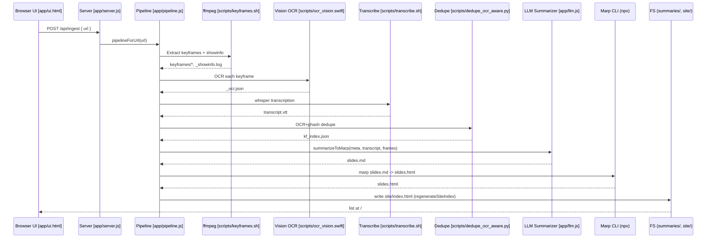

# Video Digest — Debugging Spec (E2E Runbook)

This document orchestrates end-to-end debugging so the app reliably ingests a YouTube URL and produces a slide deck and site index without modifying application code.

Test URL: https://www.youtube.com/watch?v=lXEnnoXX-nA

Key entry points:
- Web server: [server.js](app/server.js:36) — default port fallback 7777; endpoints /, /api/ingest, /api/list
- Pipeline orchestrator: [pipelineForUrl()](app/pipeline.js:12)
- LLM slide generation: [summarizeToMarp()](app/llm.js:7) → OpenAI call at [app/llm.js](app/llm.js:30)
- Subprocesses:
  - ffmpeg keyframes: [scripts/keyframes.sh](scripts/keyframes.sh:6)
  - showinfo parsing: [scripts/parse_showinfo.js](scripts/parse_showinfo.js:1)
  - Apple Vision OCR helper: build via [scripts/build_ocr.sh](scripts/build_ocr.sh:3); code in [scripts/ocr_vision.swift](scripts/ocr_vision.swift:1)
  - OCR + pHash dedupe: [scripts/dedupe_ocr_aware.py](scripts/dedupe_ocr_aware.py:1)
  - Transcription: [scripts/transcribe.sh](scripts/transcribe.sh:11) (expects whisper-cli)
  - VTT cleanup: [scripts/clean_vtt.py](scripts/clean_vtt.py:1)

Success criteria:
- Able to run: npm install → npm run build-ocr → npm run dev → POST /api/ingest with URL
- Slides generated at summaries/videos/lXEnnoXX-nA/slides.html
- Site index rendered at /site/index.html
- No hard-coded env vars; all configuration comes from .env loaded by [server.js](app/server.js:1) and [pipeline.js](app/pipeline.js:1)

System Requirements (macOS Apple Silicon)
- Node.js >= 20 LTS (ESM; OpenAI SDK v4 requires Node 18+)
- Homebrew-installed binaries:
  - ffmpeg, yt-dlp, jq, python3, swiftc (via Xcode CLT), tesseract (optional), npx (via Node/npm)
- Python venv site-packages: Pillow, ImageHash, numpy
- OpenAI credentials via .env:
  - OPENAI_API_KEY (required)
  - OPENAI_MODEL (optional; default in [app/llm.js](app/llm.js:5); suggested fallback gpt-4o-mini if gpt-5 unavailable)
- Marp CLI via on-demand npx during pipeline at [pipelineForUrl()](app/pipeline.js:71)

Architecture and Data Flow

Configuration (.env)
- OPENAI_API_KEY=...
- OPENAI_MODEL=gpt-5 (or fallback gpt-4o-mini)
- SUMMARIES_DIR=./summaries
- SITE_DIR=./site
- SCENE_THRESH=0.30
- PHASH_THRESH=6
- RUN_JOIN_SEC=60
- TEXT_JACCARD=0.90
- SIMHASH_HAMMING=3
- ALIGN_LOOKBACK_SEC=600

Preflight Checks (copy-pasteable)
- $ node -v
- $ npm -v
- $ which ffmpeg && ffmpeg -version
- $ which yt-dlp && yt-dlp --version
- $ python3 -V
- $ python3 -m pip show pillow imagehash numpy
- $ xcode-select -p && swiftc --version
- $ npx --yes @marp-team/marp-cli --version
- $ test -n "$OPENAI_API_KEY" && echo OK || echo MISSING
- $ test -d summaries && test -w summaries && echo summaries OK || echo summaries NOT WRITABLE
- $ test -d site && test -w site && echo site OK || echo site NOT WRITABLE

Setup Steps
- 1) Install Node deps: $ npm install
- 2) Build OCR helper: $ npm run build-ocr (calls [scripts/build_ocr.sh](scripts/build_ocr.sh:3))
- 3) Create .env with keys in “Configuration (.env)” above. Do not commit .env; ensure .gitignore covers it.

Runbook: End-to-End
- 1) Start dev server: $ npm run dev (see listen in [server.js](app/server.js:36))
- 2) Open UI: http://localhost:7777/ and submit the test URL, or run:
  - $ curl -s -X POST http://localhost:7777/api/ingest -H 'Content-Type: application/json' -d '{"url":"https://www.youtube.com/watch?v=lXEnnoXX-nA","focus":""}'
- 3) Observe logs: pipeline logs each subprocess with “>” prefix from [sh()](app/pipeline.js:9) and [run()](app/pipeline.js:10)
- 4) Expected artifacts in summaries/videos/lXEnnoXX-nA/:
  - meta.json
  - keyframes/*
  - kf_index.json
  - transcript.vtt
  - transcript_clean.md
  - slides.md
  - slides.html
- 5) Site index regenerated by [regenerateSiteIndex()](app/pipeline.js:91) to /site/index.html

Known/Probable Failure Points and Remedies
- 1) whisper-cli not found ([scripts/transcribe.sh](scripts/transcribe.sh:11))
  - Remedy: $ brew install whisper-cli
  - Alternate: $ brew install whisper-cpp and provide a wrapper or adjust script later; temporary symlink named whisper-cli if compatible.
- 2) Python deps missing for dedupe ([scripts/dedupe_ocr_aware.py](scripts/dedupe_ocr_aware.py:1))
  - Remedy: $ python3 -m venv .venv && source .venv/bin/activate && pip install pillow ImageHash numpy
- 3) Swift OCR helper missing ([scripts/build_ocr.sh](scripts/build_ocr.sh:3))
  - Remedy: $ npm run build-ocr; ensure Xcode CLT installed: $ xcode-select --install
- 4) ffmpeg or yt-dlp missing
  - Remedy: $ brew install ffmpeg yt-dlp
- 5) OpenAI model access errors at [app/llm.js](app/llm.js:30)
  - Remedy: Verify OPENAI_API_KEY and set OPENAI_MODEL to an available model (e.g., gpt-4o-mini) in .env
- 6) Permission/path issues for summaries/ or site/
  - Remedy: Ensure directories exist and are writable; SUMMARIES_DIR/SITE_DIR used by [app/pipeline.js](app/pipeline.js:6)

Observability and Logging Guidance
- Capture all server stdout during a run.
- Every external command is prefixed with “>”; record the exact failing command, exit code, and stderr.
- For exceptions thrown by [run()](app/pipeline.js:10), note the tool that failed and any partial artifacts written.

Acceptance Criteria Checklist
- [ ] Server starts and listens on 7777 ([server.js](app/server.js:36))
- [ ] POST /api/ingest queues job and pipeline runs to completion ([pipelineForUrl()](app/pipeline.js:12))
- [ ] slides.html exists and renders (summaries/videos/lXEnnoXX-nA/slides.html)
- [ ] /site/index.html lists the new deck ([regenerateSiteIndex()](app/pipeline.js:91))

Security and Privacy
- Never print or commit API keys. Keep credentials only in .env consumed by [server.js](app/server.js:1) and [pipeline.js](app/pipeline.js:1)
- Do not paste secrets into logs or the worklog. Redact if required.

Quick Links
- [server.js](app/server.js)
- [pipeline.js](app/pipeline.js)
- [llm.js](app/llm.js)
- [ui.html](app/ui.html)
- [keyframes.sh](scripts/keyframes.sh)
- [transcribe.sh](scripts/transcribe.sh)
- [dedupe_ocr_aware.py](scripts/dedupe_ocr_aware.py)
- [ocr_vision.swift](scripts/ocr_vision.swift)
- [build_ocr.sh](scripts/build_ocr.sh)
- [parse_showinfo.js](scripts/parse_showinfo.js)
- [clean_vtt.py](scripts/clean_vtt.py)

End of spec.